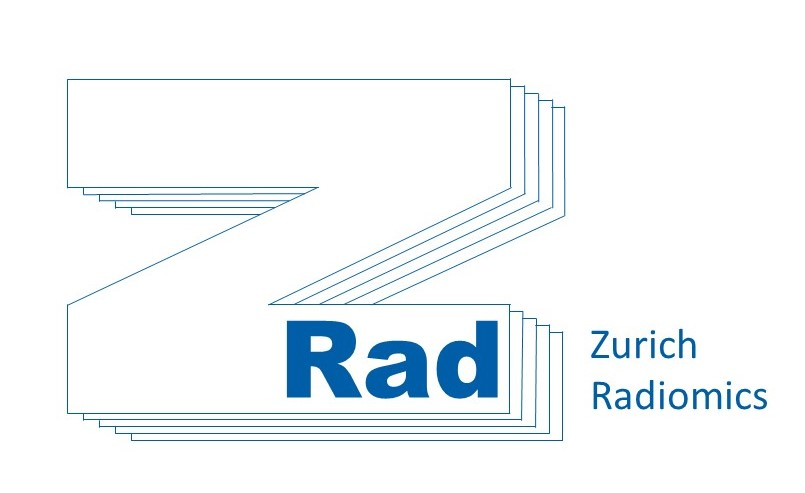
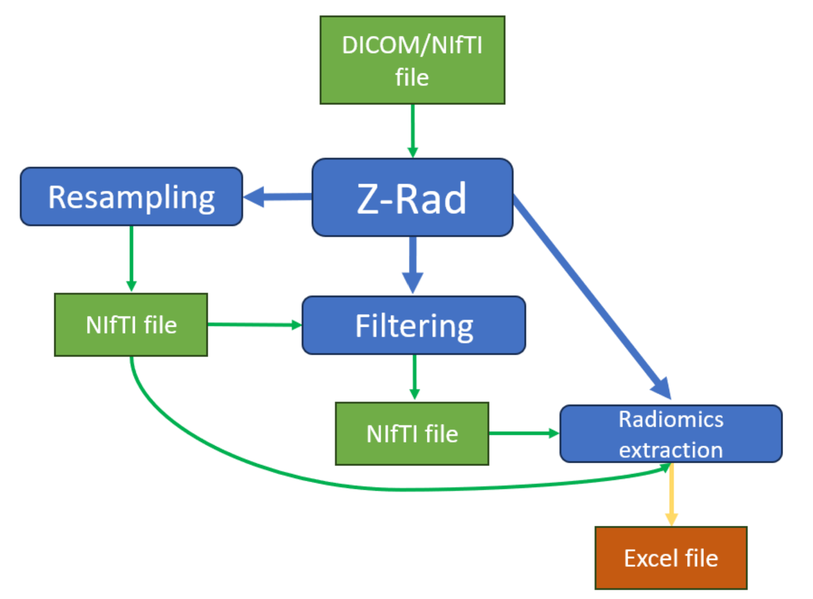

# Z-RAD



Radiomics is the high-throughput extraction of quantitative features from medical images, 
revolutionizing personalized medicine and enhancing clinical decision-making. 
Despite its potential, radiomics faces several challenges, including the need for programming skills 
and lack of standardization.

**Z-Rad (Zurich Radiomics)**, developed by the Radiation Oncology Department at the University Hospital Zurich, 
addresses these issues by offering a user-friendly, IBSI-compliant, and open-source solution for radiomics analysis.

## Z-Rad Features

### User-Friendly Interface
- **Graphical User Interface (GUI)**: Designed for medical professionals with no programming skills.
- **Application Programming Interface (API)**: Allows researchers to customize, automate, and extend Z-Rad functionalities using Python.

### Compatibility
- **Medical Data Formats**: Supports CT, PET, and MR imaging modalities in both DICOM and NIfTI formats.
- **Operating Systems**: Windows, macOS, and Linux.

### Standard Compliance
- **IBSI Compliance**: Adheres to IBSI I and IBSI II standards for reproducible and comparable radiomics features.


## Software Architecture and Design

### Backend
- **Programming Language**: Written in Python.
- **External Libraries**: Utilizes PyQt5, SimpleITK, Pydicom, NumPy, SciPy, Pandas, PyWavelets, scikit-image, scikit-learn, and OpenCV.

### Radiomics Extraction Pathways



## Graphical User Interface (GUI) and Application Programming Interface (API)

Both GUI and API are structured into three primary classes: **Resampling**, **Filtering**, and **Radiomics**:

### Resampling
Z-Rad supports image resampling alone, alongside regions of interest (ROI) masks, or converting DICOM files to NIfTI 
images and masks without resampling. Resampling can be performed in 3D or 2D (axial slice-wise), with nearest 
neighbors, linear, B-spline, and Gaussian strategies.

### Filtering
This tab requires users to define the desired filter settings. 
The current version of Z-Rad supports mean, Laplace of Gaussian, Laws kernels, 
and wavelet (Daubechies 2, Daubechies 3, first-order Coiflet, and Haar) filters.

### Radiomics Feature Extraction
Parameters for radiomics feature extraction include the intensity re-segmentation 
(e.g., HU for CT or SUV for PET within ROIs) and intensity outlier filtering, 
discretisation strategies, and a variety of radiomics feature aggregation methods covering 2D, 2.5D, and 3D options. 
Radiomic features include shape, intensity, grey level co-occurrence matrix (GLCM), 
grey level run length matrix (GLRLM), grey level distance zone matrix (GLDZM), 
neighbouring gray tone difference matrix (NGTDM), 
and neighbouring gray level dependance matrix (NGLDM) features families.

## Error and Warning Handling

- **GUI**: Uses warning pop-up messages for immediate feedback.
- **API**: Records processes in log files for comprehensive documentation.

## Installation and Get Started

### Windows .exe file:

The simplest way to run Z-rad on Windows is to start the `main.exe` file located in the `\exec` folder.

### Windows, Linux, and macOS
For advanced Python users, we recommend: 

1. Clone the Z-Rad repository
2. Open the terminal and navigate to the project directory
3. Install requirements by typing in the terminal:

```sh
pip install -r requirements.txt
```

4. Run the `main.py` file:

```sh
python main.py
```

## License

Z-Rad is an open-source project licensed under the MIT License.

## Contact

For any questions or feedback, please contact us at [zrad@usz.ch](mailto:zrad@usz.ch).

---